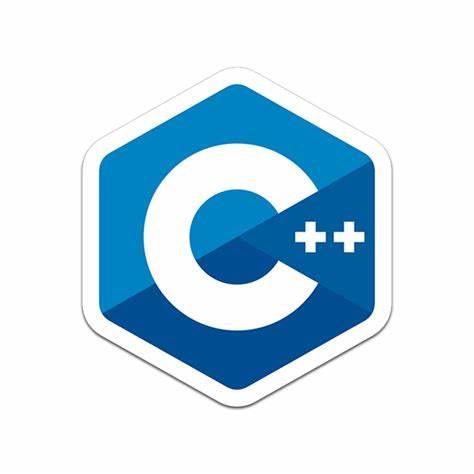

# Zhichen LU —— Sorbonne University M2 —— Advanced systems and robotics

   
### **Technology Stacks:**
<a href="https://www.python.org"><code></code></a>
<a href="https://pytorch.org/"><code></code></a>
<a href="https://www.tensorflow.org/"><code></code></a>
<a href="https://www.mathworks.com/products/matlab.html"><code></code></a>
<a href="https://www.solidworks.com/"><code></code></a>
<a href="https://www.3ds.com/products-services/catia/"><code></code></a>
<a href="https://isocpp.org/"><code></code></a>

### **Projects:**
1. [Simulation Robotics Program](https://github.com/rainbowl99/Projet-de-Simulation-robotique.git) : Design basic simulation classes and methods to implement different simulation scenarios such as free fall, spring-damped systems, oscillating systems, etc. 
2. [Interface Haptique FALCON](https://github.com/rainbowl99/Interface-Haptique-FALCON.git) : The first part is an exploration of the Novint Falcon device, including workspace sizing, implementation of virtual springs and dampers, and analysis of relevant data. The second part involves integrating the Novint Falcon into a physics simulator and using Blender software to manipulate virtual objects, such as interacting with virtual walls, spheres and cubes via haptic interfaces. 
3. [Controls for a non-holonomic mobile robot](https://github.com/rainbowl99/Commandes_d-un_robot_mobile_non_holonome.git) 
4. [Optimization Solution for the movement of a 2ddl robotic arm](https://github.com/rainbowl99/Optimisation_Solution_pour_le_mouvement_d-un_bras_robotique_a_2ddl.git) 
5. [POO](https://github.com/rainbowl99/POO.git) : Design a 2d flat racing game. 
6. [ROS_turtlebot3](https://github.com/rainbowl99/ROS_turtlebot3.git) : An anthropomorphic auto-navigation task was accomplished using turtlebot3, based on the ros2 environment, and further testing was completed in the real world. 
7. [MLA Projet reproduction](https://github.com/rainbowl99/MLA_Projet_reproduction.git) : Reproduce the appropriate code based on the article on machine learning. 
8. [Resolution of the inverse geometric model of the STAUBLI RX90 arm](https://github.com/rainbowl99/Resolution_du_modele_geometriqueinverse_du_bras_STAUBLI_RX90.git) : Using this robotic arm, matlab code is designed to accomplish the forward and inverse motion solution in the workspace. 
9. [Saboteur](https://github.com/rainbowl99/Saboteur.git) 
10. [Trajectory tracking](https://github.com/rainbowl99/Suivi_Chemin.git) : The aim of the project is to apply trajectory tracking algorithms for wheeled robots (in particular unicycle robots) using Matlab Simulink. The focus is on demonstrating these algorithms using several unicycle robots moving along the same trajectory in a convoy. 
11. [Identification 2ddl Dynamic arm](https://github.com/rainbowl99/Identification_2ddl_Bras_dynamique.git) : The aim of the project is to identify the parameters of a dynamic model of a manipulator with two degrees of freedom. This involves a theoretical study to obtain a recognizable form of the model for a specific case, as well as the practical application of the recognition technique in MATLAB and analysis of the results. 
12. [IDENTIFICATION OF A PLANAR ROBOT RR](https://github.com/rainbowl99/IDENTIFICATION-D-UN-ROBOT-PLAN-RR.git) : The aim of this task is to identify the inertial and geometrical properties of a planar RRR robot. By analyzing angle and torque signals based on a periodic trajectory, the aim is to deduce the dynamic parameters of the two-degree-of-freedom robot. 

### Github activity level

   
   

