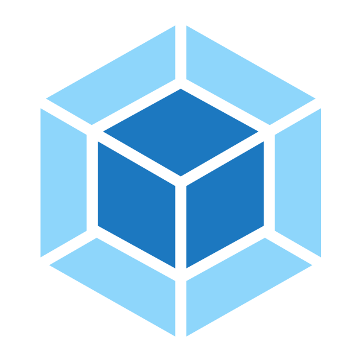

# rainbowl99.github.io

### **技术栈:**

<a href="https://v3.cn.vuejs.org"><code></code></a>
<a href="https://reactjs.org/"><code></code></a>
<a href="https://nextjs.org/"><code></code></a>
<a href="https://www.tslang.cn/index.html"><code></code></a>
<a href="https://webpack.js.org/"><code></code></a>
<a href="https://cn.vitejs.dev"><code></code></a>
<a href="https://sass-lang.com"><code></code></a>
<a href="https://tailwindcss.com"><code></code></a>
<a href="https://go.dev/"><code></code></a>
<a href="https://www.docker.com"><code></code></a>

### Project

1. [Projet-de-Simulation-robotique](https://github.com/rainbowl99/Projet-de-Simulation-robotique.git) 
2. [Interface-Haptique-FALCON](https://github.com/rainbowl99/Interface-Haptique-FALCON.git) 
3. [Commandes d'un robot mobile non holonome](https://github.com/rainbowl99/Commandes_d-un_robot_mobile_non_holonome.git) 
4. [Optimisation Solution pour le mouvement d'un bras robotique a 2ddl](https://github.com/rainbowl99/Optimisation_Solution_pour_le_mouvement_d-un_bras_robotique_a_2ddl.git) 
5. [POO](https://github.com/rainbowl99/POO.git) 
6. [ROS_turtlebot3](https://github.com/rainbowl99/ROS_turtlebot3.git) 
7. [MLA Projet reproduction](https://github.com/rainbowl99/MLA_Projet_reproduction.git) 
8. [Resolution du modele geometrique inverse du bras STAUBLI RX90](https://github.com/rainbowl99/Resolution_du_modele_geometriqueinverse_du_bras_STAUBLI_RX90.git) 
9. [Saboteur](https://github.com/rainbowl99/Saboteur.git) 
10. [Suivi Chemin](https://github.com/rainbowl99/Suivi_Chemin.git) 
11. [Identification 2ddl Bras dynamique](https://github.com/rainbowl99/Identification_2ddl_Bras_dynamique.git) 
12. [IDENTIFICATION-D-UN-ROBOT-PLAN-RR](https://github.com/rainbowl99/IDENTIFICATION-D-UN-ROBOT-PLAN-RR.git) 

### Github activity level

